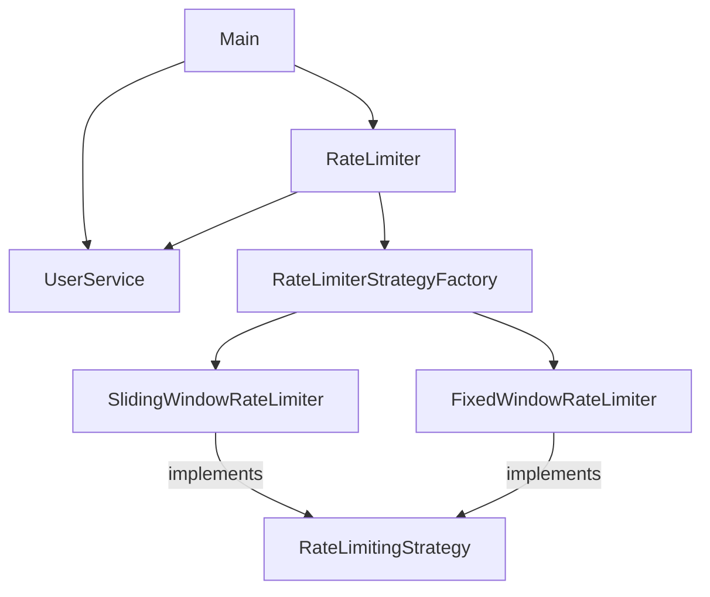
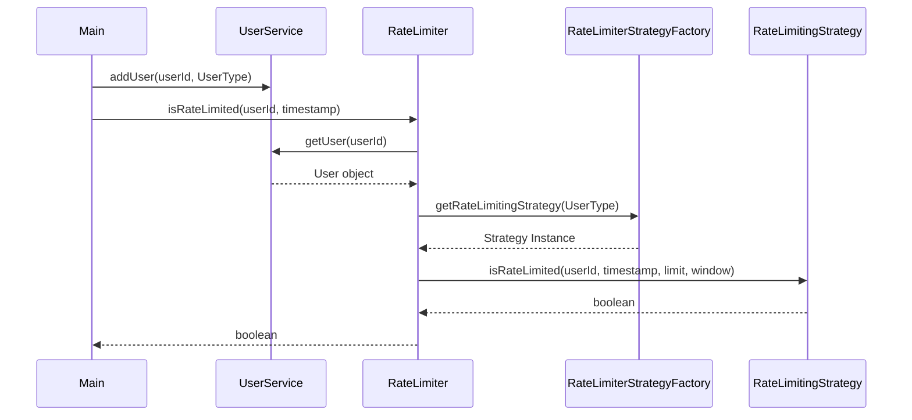

# Rate Limiter System

A flexible Rate Limiter implementation in Java supporting multiple strategies (Fixed Window and Sliding Window) based on user types.

## Overview

The system allows managing request rates for different users based on their subscription tier (`PRO` or `FREE`). It uses the Strategy Pattern to decouple the rate-limiting logic from the main application flow and a Factory Pattern to instantiate the appropriate strategy.

## Key Components

- **Main**: Entry point that demonstrates the system usage.
- **RateLimiter**: High-level component that orchestrates the rate-limiting process.
- **UserService**: Manages user information and their associated types.
- **RateLimitingStrategy**: Interface for different rate-limiting algorithms.
- **SlidingWindowRateLimiter**: Implements the sliding window algorithm (used for `PRO` users).
- **FixedWindowRateLimiter**: Implements the fixed window algorithm (used for `FREE` users).
- **RateLimiterStrategyFactory**: Decides which strategy to use for a given user type.

## Complete Flow

1. **Initialization**: The `Main` class initializes `UserService` and `RateLimiter`.
2. **User Setup**: Users are added to the `UserService` with specific `UserType` (`PRO` or `FREE`).
3. **Request Processing**: When `isRateLimited(userId, timestamp)` is called on the `RateLimiter`:
    - It fetches the `UserType` from `UserService`.
    - It requests the appropriate `RateLimitingStrategy` from the `RateLimiterStrategyFactory`.
    - It executes the `isRateLimited` method of the selected strategy.
4. **Strategy Execution**:
    - **Sliding Window**: Maintains a queue of timestamps for each user within the current window.
    - **Fixed Window**: Tracks request counts within fixed time intervals.
5. **Result**: Returns `true` if the request should be limited, `false` otherwise.

## Block Diagram



## Sequence Diagram



## How to Run

Compile the project:
```bash
mvn compile
```

Run the demonstration:
```bash
mvn exec:java -Dexec.mainClass="com.example.Main"
```
